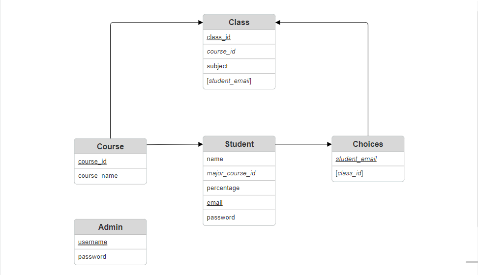

# Open Course Allotment System

An interface for students to register and choose their courses, and for admins to allot students based on their choices and academic performance.

* [Views](./OpenCourseAllotment/views.py)
* [Models](./OpenCourseAllotment/models.py)
* [Urls](./OpenCourseAllotment/urls.py)
* [Templates](./OpenCourseAllotment/templates/OpenCourseAllotment/)
* [Styles](./OpenCourseAllotment/static/OpenCourseAllotment/)

